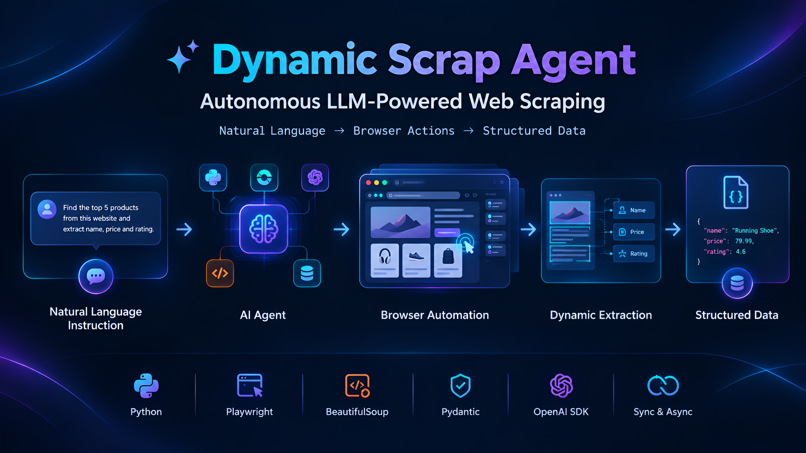

# 🤖 DynamicScrap

### Autonomous LLM-Powered Web Scraping Agent

**DynamicScrap** is an autonomous, LLM-driven web scraping agent built with **Python, Playwright, BeautifulSoup, Pydantic, and the OpenAI SDK**.

It converts **natural-language instructions into browser actions**, navigates websites dynamically, and extracts data into a user-defined schema — without requiring hardcoded CSS or XPath selectors.

<p align="center">
  
</p>

<p align="center">
  <b>Natural Language → LLM Agent → Browser Automation → Dynamic Extraction → Structured Data</b>
</p>

---

## 🚀 Why DynamicScrap?

Traditional web scrapers usually depend heavily on fixed CSS selectors or XPath expressions.

When a website changes its structure, those selectors can stop working.

DynamicScrap takes a different approach:

```text
┌─────────────────────────┐
│   Natural Language Task │
└────────────┬────────────┘
             ↓
┌─────────────────────────┐
│       LLM Agent         │
│   Planning & Decisions  │
└────────────┬────────────┘
             ↓
┌─────────────────────────┐
│       Playwright        │
│   Browser Automation    │
└────────────┬────────────┘
             ↓
┌─────────────────────────┐
│      Web Page / Site    │
└────────────┬────────────┘
             ↓
┌─────────────────────────┐
│ Dynamic Data Extraction │
│ BeautifulSoup + LLM    │
└────────────┬────────────┘
             ↓
┌─────────────────────────┐
│    Validation & Repair  │
└────────────┬────────────┘
             ↓
┌─────────────────────────┐
│     Structured JSON     │
└─────────────────────────┘
```

The goal is simple:

> **Tell the agent what data you need, instead of telling it exactly where the data is.**

---

## ✨ Key Features

* 🧠 **LLM-Powered Navigation**
  Dynamically plans browser actions based on natural-language instructions.

* 🌐 **Browser Automation**
  Uses Playwright for real browser interaction.

* 🔎 **Search Handling**
  Detects visible search inputs, enters queries, and submits them.

* 🖱️ **Dynamic Actions**
  Supports actions such as click, type, hover, scroll, wait, pagination, and tab handling.

* 📦 **Dynamic Extraction**
  Uses LLM-assisted extraction with BeautifulSoup as a parsing layer.

* 🧩 **Schema Mapping**
  Maps extracted data into the structure defined by the user.

* ✅ **Validation**
  Checks whether required fields were successfully extracted.

* 🔧 **Automatic Repair**
  Attempts corrective actions when required data is missing.

* ⚡ **Sync + Async Support**
  Provides both synchronous and asynchronous implementations.

* 🤖 **OpenAI-Compatible Providers**
  Supports providers that expose an OpenAI-compatible API interface.

* 🏠 **Local LLM Support**
  Can be configured with local models through Ollama.

---

## 🏗️ Architecture

```text
                    USER TASK
                       │
                       ▼
              ┌─────────────────┐
              │   LLM PLANNER   │
              │  Understands    │
              │     intent      │
              └────────┬────────┘
                       │
                       ▼
              ┌─────────────────┐
              │    PLAYWRIGHT   │
              │     BROWSER     │
              └────────┬────────┘
                       │
                       ▼
              ┌─────────────────┐
              │   WEB PAGE      │
              │  Navigation     │
              │  Search         │
              │  Click / Hover  │
              │  Pagination     │
              └────────┬────────┘
                       │
                       ▼
              ┌─────────────────┐
              │    EXTRACTION   │
              │ BeautifulSoup + │
              │      LLM        │
              └────────┬────────┘
                       │
                       ▼
              ┌─────────────────┐
              │   VALIDATION    │
              │       +         │
              │     REPAIR      │
              └────────┬────────┘
                       │
                       ▼
              ┌─────────────────┐
              │ STRUCTURED DATA │
              │      JSON       │
              └─────────────────┘
```

---

## 🧰 Tech Stack

| Technology                | Purpose                    |
| ------------------------- | -------------------------- |
| 🐍 Python                 | Core implementation        |
| 🎭 Playwright             | Browser automation         |
| 🍲 BeautifulSoup4         | HTML parsing               |
| 🧱 Pydantic               | Task and schema validation |
| 🤖 OpenAI SDK             | LLM communication          |
| 🧠 OpenAI-Compatible APIs | LLM provider flexibility   |
| 🏠 Ollama                 | Local LLM support          |

---

## 📁 Project Structure

```text
DynamicScrap/
│
├── DynamicScrap.py
├── DynamicScrapAsync.py
│
├── example_github_scrap.py
├── example_github_scrap_async.py
│
├── example_amazon_scrap.py
├── example_amazon_scrap_async.py
│
├── requirements.txt
├── DynamicScrap.png
└── README.md
```

### Implementations

**`DynamicScrap.py`**

Synchronous implementation using:

```python
OpenAI
playwright.sync_api
```

**`DynamicScrapAsync.py`**

Asynchronous implementation using:

```python
AsyncOpenAI
playwright.async_api
```

---

# ⚡ Quick Start

## 1. Clone the Repository

```bash
git clone https://github.com/MayurMathavadiya/DynamicScrap.git
cd DynamicScrap
```

## 2. Create Virtual Environment

```bash
python3 -m venv .venv
source .venv/bin/activate
```

## 3. Install Dependencies

```bash
pip install -r requirements.txt
```

## 4. Install Chromium

```bash
playwright install chromium
```

---

# 🔐 Configuration

Create a `.env` file in the project directory.

For OpenAI-compatible providers:

```env
BASE_URL="https://api.groq.com/openai/v1"
API_KEY="your-api-key"
MODEL="your-model-name"
```

The examples use `load_dotenv()`, so the variables can be stored locally in `.env`.

> ⚠️ Never commit your `.env` file or API keys to GitHub.

---

# 💻 Basic Example

```python
import os
import json

from dotenv import load_dotenv
from openai import OpenAI

from DynamicScrap import (
    DynamicScrapeAgent,
    TaskSchema,
    ScrapeTask,
)

load_dotenv()

task = ScrapeTask(
    url="https://news.ycombinator.com/",
    extract_instruction="Extract the top 5 stories with title and link.",
    output_schema=TaskSchema(
        items=[
            {
                "title": "string",
                "link": "string",
            }
        ],
    ),
    required_fields=["title", "link"],
    max_pages=1,
    total_timeout_sec=120,
)

client = OpenAI(
    base_url=os.environ.get("BASE_URL"),
    api_key=os.environ.get("API_KEY"),
)

agent = DynamicScrapeAgent(
    model=os.environ.get("MODEL"),
    client=client,
    task=task.model_dump(),
    headless=True,
)

try:
    result = agent.run_task()

    print(
        json.dumps(
            result["data"],
            indent=2,
            ensure_ascii=False,
        )
    )

    if not result["ok"]:
        print(
            json.dumps(
                result["diagnostics"],
                indent=2,
                ensure_ascii=False,
            )
        )

finally:
    agent.close()
```

---

# ⚡ Async Example

For applications using `asyncio`, use `DynamicScrapAsync.py`.

```python
import os
import json
import asyncio

from dotenv import load_dotenv
from openai import AsyncOpenAI

from DynamicScrapAsync import (
    DynamicScrapeAgent,
    TaskSchema,
    ScrapeTask,
)

load_dotenv()

async def main():

    task = ScrapeTask(
        url="https://news.ycombinator.com/",
        extract_instruction="Extract the top 5 stories with title and link.",
        output_schema=TaskSchema(
            items=[
                {
                    "title": "string",
                    "link": "string",
                }
            ],
        ),
        required_fields=["title", "link"],
        max_pages=1,
        total_timeout_sec=120,
    )

    client = AsyncOpenAI(
        base_url=os.environ.get("BASE_URL"),
        api_key=os.environ.get("API_KEY"),
    )

    agent = DynamicScrapeAgent(
        model=os.environ.get("MODEL"),
        client=client,
        task=task.model_dump(),
        headless=True,
    )

    try:
        result = await agent.run_task()

        print(
            json.dumps(
                result["data"],
                indent=2,
                ensure_ascii=False,
            )
        )

    finally:
        await agent.close()


if __name__ == "__main__":
    asyncio.run(main())
```

---

# 🔍 Task Configuration

| Parameter             | Type         | Required | Default | Description                                 |
| --------------------- | ------------ | -------: | ------: | ------------------------------------------- |
| `url`                 | `str`        |        ✅ |       — | Initial page URL                            |
| `extract_instruction` | `str`        |        ✅ |       — | Natural-language extraction instruction     |
| `output_schema`       | `TaskSchema` |        ✅ |       — | Expected output fields and types            |
| `search_query`        | `str`        |        ❌ |  `None` | Query to submit through the page search box |
| `action_instruction`  | `str`        |        ❌ |  `None` | Browser action instructions                 |
| `required_fields`     | `List[str]`  |        ❌ |  `None` | Fields required for validation              |
| `max_pages`           | `int`        |        ❌ |     `1` | Number of pages to collect                  |
| `max_repairs`         | `int`        |        ❌ |     `2` | Maximum repair attempts                     |
| `total_timeout_sec`   | `int`        |        ❌ |   `300` | Overall task timeout                        |

---

# 🧪 Examples

## GitHub Scraping

```bash
python3 example_github_scrap.py
```

Demonstrates browser navigation and hover interactions.

## Amazon Scraping

```bash
python3 example_amazon_scrap.py
```

Demonstrates:

* Search
* Dynamic extraction
* Pagination
* Validation

## Async Examples

```bash
python3 example_github_scrap_async.py
python3 example_amazon_scrap_async.py
```

---

# 🤖 LLM Providers

DynamicScrap uses the **OpenAI SDK interface**, which makes it possible to work with OpenAI-compatible providers.

## OpenAI

```python
from openai import OpenAI

client = OpenAI(
    api_key="your-api-key"
)
```

> When using OpenAI directly, the custom `base_url` parameter is not required.

---

## Together AI

```env
BASE_URL="https://api.together.xyz/v1"
API_KEY="your-api-key"
MODEL="your-model"
```

---

## OpenRouter

```env
BASE_URL="https://openrouter.ai/api/v1"
API_KEY="your-api-key"
MODEL="your-model"
```

---

## Ollama

DynamicScrap can also work with a locally hosted Ollama model.

```env
BASE_URL="http://localhost:11434/v1"
API_KEY="ollama"
MODEL="qwen2.5:7b"
```

This makes it possible to experiment with **local LLM-powered scraping workflows** without sending model requests to a cloud provider.

---

# 🆚 Traditional Scraping vs DynamicScrap

### Traditional Scraper

```text
Website
   ↓
CSS / XPath Selector
   ↓
HTML Element
   ↓
Extract Data
```

If the website structure changes:

```text
❌ Selector may break
❌ Scraper may require code changes
```

### DynamicScrap

```text
Natural Language Instruction
            ↓
         LLM Agent
            ↓
    Understand Website
            ↓
    Navigate Dynamically
            ↓
      Extract Data
            ↓
        Validate
            ↓
     Structured Output
```

The objective is to move from:

**Selector-driven scraping**

to:

**Instruction-driven scraping**

---

# 🖱️ Browser Actions

The agent can dynamically work with browser actions including:

* Click
* Type
* Hover
* Scroll
* Wait
* Search
* Pagination
* Tab handling
* Navigation
* Data extraction

---

# 🗺️ Roadmap

* [ ] More browser actions
* [ ] Improved extraction strategies
* [ ] More robust repair workflows
* [ ] Concurrent website scraping
* [ ] Persistent browser sessions
* [ ] More local LLM integrations
* [ ] Web UI for task creation
* [ ] CSV / Excel / database export
* [ ] Better observability and debugging
* [ ] Multi-agent scraping workflows

---

# 🤝 Contributing

Contributions, issues, and feature requests are welcome.

To contribute:

1. Fork the repository
2. Create a feature branch
3. Make your changes
4. Test your changes
5. Open a Pull Request

---

# ⚠️ Responsible Use

DynamicScrap automates browser interaction and web data extraction.

Users are responsible for ensuring that their scraping activities comply with:

* Website Terms of Service
* `robots.txt`
* Applicable laws
* Data privacy requirements
* Copyright requirements

Please use the project responsibly.

---

# ⭐ Support the Project

If you find **DynamicScrap** useful:

⭐ **Star** the repository
🍴 **Fork** the project
🐛 **Report** issues
💡 **Suggest** improvements
🤝 **Contribute** to the project

---

## 📄 License

See the repository for license information.
